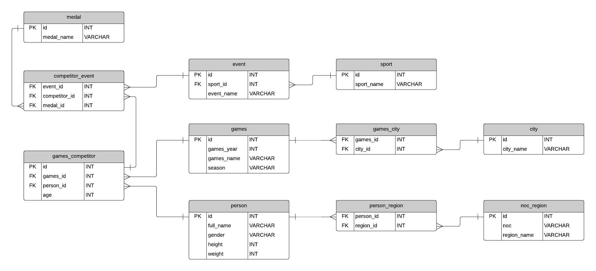

# SportStats
Olympics is considered as the most important event worldwide, which provides a common platform to players from various nations to show their talents. The ‘modern Olympics’
comprises all the Games from Athens 1986 to Rio 2016. The Olympics is more than just a quadrennial multi-sport world championship. It is a lens through which to understand global
history, including shifting geopolitical power dynamics, women’s empowerment, and the evolving values of society.

In this repository, my goal is to shed light on major patterns in Olympic history. How many
athletes, sports, and nations are there? Where do most athletes come from? Who wins medals?
What are the characteristic of the athletes (e.g., gender and physical size)?

I also zoom in on some particularly interesting aspects of Olympic history that you might
not know about. Did you know that Nazi Germany hosted the 1936 Olympics and they totally
kicked everyone’s asses? These are the sort of tidbits I like to sprinkle in.

### Entity relationship diagram
